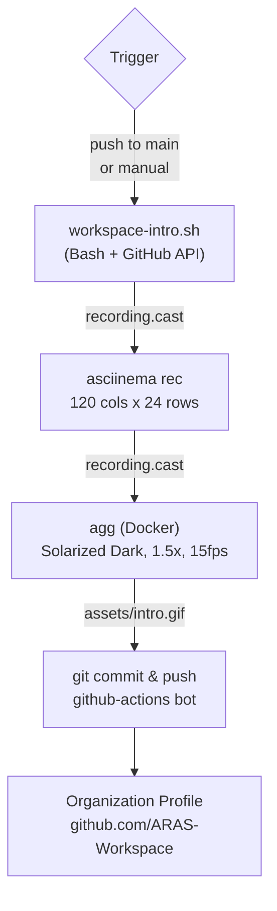

# ARAS Workspace Organization Profile (.github) Repository

Organization profile and shared configurations for [ARAS-Workspace](https://github.com/ARAS-Workspace).

## Overview

This repository contains:

- **Organization Profile** — Dynamic terminal animation displayed on the organization page
- **Workflows** — GitHub Actions for automated content generation

## Pipeline



## Structure

```
.github/
├── profile/
│   └── README.md                ← Organization profile
├── assets/
│   └── intro.gif                ← Terminal animation (auto-generated)
├── scripts/
│   ├── workspace-intro.sh       ← Animation script
│   └── runner-setup.sh          ← Runner setup script
└── .github/
    └── workflows/
        └── generate-intro.yml   ← Animation workflow
```

## Configuration

Editable constants in [`scripts/workspace-intro.sh`](scripts/workspace-intro.sh):

```bash
# GitHub
GITHUB_ORG="ARAS-Workspace"

# Domain & SSH
DOMAIN="aras.tc"
SSH_USER="workspace"
SSH_HOST="aras"
GUEST_USER="guest"
GUEST_HOST="local"

# Branding
AUTHOR_NAME="Rıza Emre ARAS"
AUTHOR_EMAIL="r.emrearas@proton.me"
SLOGAN="Turkish engineering, universal code."

# Animation Timing
TYPING_SPEED=0.05          # Base typing speed (seconds)
TYPING_VARIANCE=0.03       # Random variance per keystroke
COMMAND_PAUSE=0.4           # Pause after typing a command
LINE_PAUSE=0.2              # Pause between lines
SECTION_PAUSE=1.2           # Pause between sections
```

## Workflow

The `generate-intro.yml` workflow records a terminal animation using [asciinema](https://asciinema.org/) and converts it to GIF using [agg](https://github.com/asciinema/agg).

**Triggers:**
- Manual dispatch
- Changes to `scripts/workspace-intro.sh`

**Output:** `assets/intro.gif`

## License

This project is licensed under the MIT License — see the [LICENSE](LICENSE) file for details.

Third-party software licenses are documented in [THIRD_PARTY_LICENSES](THIRD_PARTY_LICENSES).